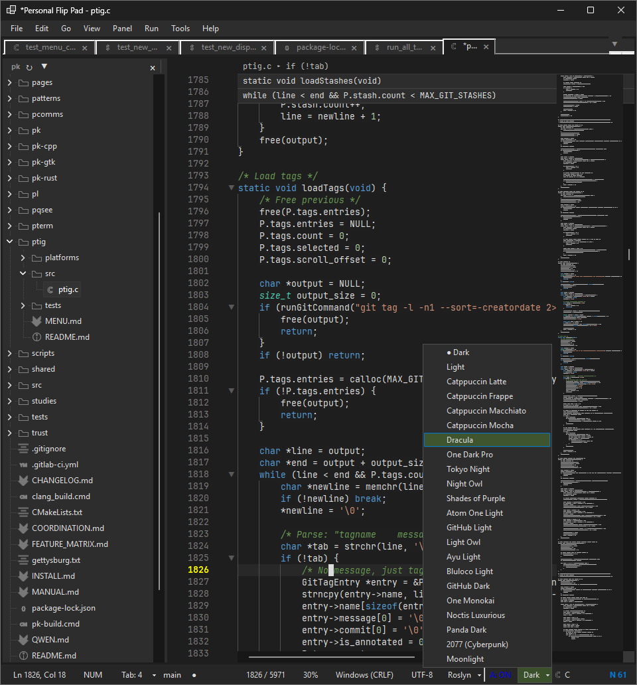

# Azure Ops — Solo Infrastructure Repository

## What This Is
Infrastructure automation, C# application code, and operational runbooks for
company-owned Azure resources. Managed by a single developer with AI assistance.

## Scope
- **Infrastructure as Code:** Terraform modules, Bicep templates
- **Applications:** C# ASP.NET Core web apps (Visual Studio Professional)
- **Code Editor:** Pfpad - Professional C# code editor with advanced features
- **Patching:** VM (Windows/Linux) and AKS cluster patching automation
- **Compliance:** Wiz vulnerability scan integration, management reporting
- **M365:** Microsoft 365 and Graph API automation
- **Pipelines:** Azure DevOps YAML for build, test, scan, deploy

## Quick Start

### Prerequisites
- Company-managed Windows laptop with Visual Studio Professional
- Azure CLI, PowerShell 7+, .NET 10 SDK, Terraform, Bicep CLI
- 2FA, VPN, company AV/EDR/Umbrella configured
- Access to company Azure DevOps or GitHub Enterprise

### Build C# App
```bash
cd apps/MyCrownJewelApp
dotnet restore
dotnet build
dotnet test
```

### Deploy Infrastructure
```bash
# Bicep
az deployment group create --resource-group rg-ops --template-file bicep/resourceGroup.bicep

# Terraform
cd infra
terraform init
terraform plan -var="environment=dev"
terraform apply -var="environment=dev"
```

### Patch VMs
```powershell
# Log a patch session
.\patching\scripts\Update-PatchLog.ps1 -Environment prod -Platform windows `
    -Critical 3 -High 9 -Status remediated

# Generate management report
.\patching\scripts\Generate-ManagementReport.ps1

# Pull fresh metrics
.\patching\scripts\Get-PatchMetrics.ps1 -Environment prod
```

### Using Pfpad Code Editor

The repository includes Pfpad **v1.0.45**, a professional C# code editor built with .NET 10 and WinForms:

```bash
cd apps/MyCrownJewelApp
dotnet build --configuration Release
# Run: bin\Release\net10.0-windows\MyCrownJewelApp.Pfpad.exe
```

**Key Features:**
- **Advanced Syntax Highlighting:** 30+ languages, incremental Channel-based pipeline (16 ms/line, 50 ms/batch), Roslyn + regex fallback, O(1) line-position index
- **Full Unicode Support:** UTF-8/16/32 with BOM detection and RTL text handling
- **Performance Profiling:** Built-in zero-allocation sampling profiler (<3% overhead)
- **Roslyn Integration:** AdhocWorkspace (instant) → MSBuildWorkspace (lazy background load); go-to-definition, hover tooltips, rename, find-all-references, diagnostics
- **Integrated Debugging:** DAP protocol (netcoredbg); conditional/logpoint/hit-count breakpoints; visual gutter indicators; hover evaluation
- **Git Integration:** Full Git operations (stage/unstage/commit/push/pull/fetch/branch/stash/tag); visual diff; conflict resolver (4-pane Base/Ours/Theirs/Merged); commit history graph
- **Large File Support:** Async load >20 MB; warning >50 MB; reject >500 MB; per-tab degradation flags disable highlighting/minimap/wordwrap
- **Terminal Integration:** Multi-tab WinForms terminal with ANSI colour, ConPTY, shell detection
- **Built-in Browser:** WebView2 browser tabs with Edge-style pill address bar (smart glyph + ⭐ star), dark-mode toggle, View Site Information flyout, YouTube ad blocking (non-skippable ads at 16× speed, MutationObserver-based volume/rate restore), 7 content filter lists with CDN allowlist, Manage Favorites with drag-to-reorder, `pfp` azure-gradient taskbar icon
- **22 Built-in Themes:** Dark/Light modes with VS Code-inspired schemes
- **Security Hardening:** 5-level security profiles (Not Hardened → Low → Mid → High → Paranoid); DPAPI encryption for settings at Mid+; URL scheme allowlist; SAST scanner; secret detection with gutter highlights; safe process launch
- **Context-Aware Menus:** 13 C#-only menu items auto-hidden for non-C# files/projects; entire Run menu hidden; orphaned separators auto-collapsed
- **Vim Mode:** Full Normal/Insert/Visual/Command/Search state machine; f/F/t/T/;/, motions; r{char}; `{n}G`; zt/zb; marks; macros; visual indent; Oem key mapping
- **Engine Hardening (.NET 10):** `FrozenSet/FrozenDictionary`, `System.Threading.Lock`, `[GeneratedRegex]` with `NonBacktracking`, `SearchValues<char/string>`, `Task.WhenAll` parallelism across all engines
- **Git Workflow (Pre-PR):** Pre-commit gate (secret scan + hook shim); staged-file review dialog; Conventional Commit composer with live preview; CI status badge (all 4 platforms)
- **Multi-platform Git:** Auto-detects GitHub / Azure DevOps / GitLab / Bitbucket / Gitea; platform badge; PR/MR template reader; CODEOWNERS hints; platform-correct PR-creation URL; footer placeholder adapts per platform
- **Git UX:** ⎇ Open PR/MR button; `NewBranchDialog` (prefix/ticket/description/live preview); CODEOWNERS reviewer hints in pre-commit banner
- **AIOps connectors (v1.0.44–45):** `GitLabConnector` (API v4, PRIVATE-TOKEN); `BitbucketConnector` (REST 2.0, Basic auth); `AzureDevOpsConnector` + `IPullRequestCapable` (API 7.1); `GitHubActionsConnector`; `AzureMonitorConnector`; `KubernetesConnector`; `PrometheusConnector`; `PagerDutyConnector` — all with DPAPI credential storage
- **ADO branch-policy warning:** Dismissable info bar after push to Azure DevOps repos (auto-hides 12 s)

See `apps/MyCrownJewelApp/docs/USER_MANUAL.md` for comprehensive documentation.

## Memory
See `MEMORY.md` for current session state, active work, and next steps.

## Security
See `SECURITY.md` for data handling rules, PII boundaries, and compliance requirements.

<p align="center">
  
</p>
